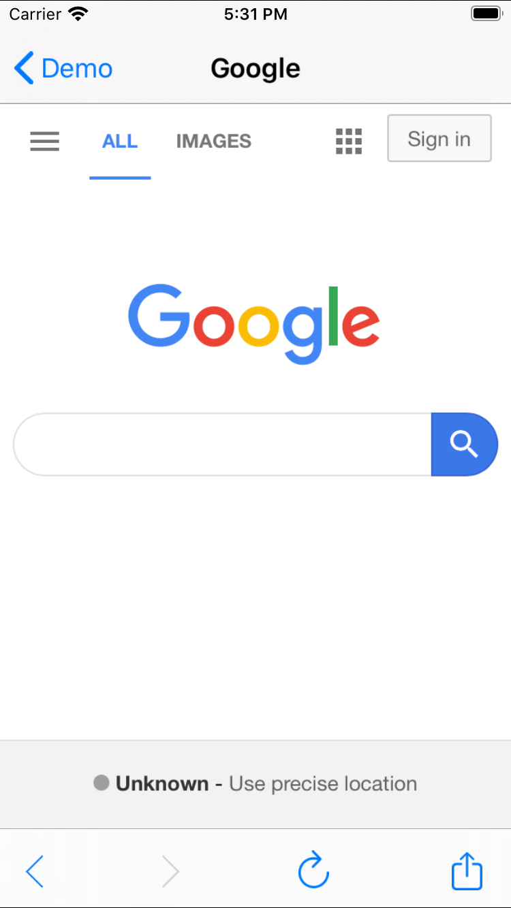

# RSTWebViewController

Originally created as an iOS 7 Web Browser RSTWebViewController is used in GBA4iOS. This version is updated to use WKWebView instead of UIWebView, to let old projects pass AppStore-Upload with UIWebView deprecation. It uses NJKWebViewProgress as progress bar indicator.



## Requirements

- iOS 8.0 or later
- ARC

## Install

### CocoaPods

```sh
pod 'NJKWebViewProgress', :git => 'https://github.com/rafaelmaeuer/NJKWebViewProgress.git'
pod 'RSTWebViewController', :git => 'https://github.com/rafaelmaeuer/RSTWebViewController-Legacy.git'
```

## License

[MIT]: http://www.opensource.org/licenses/mit-license.php
[MIT license][MIT]